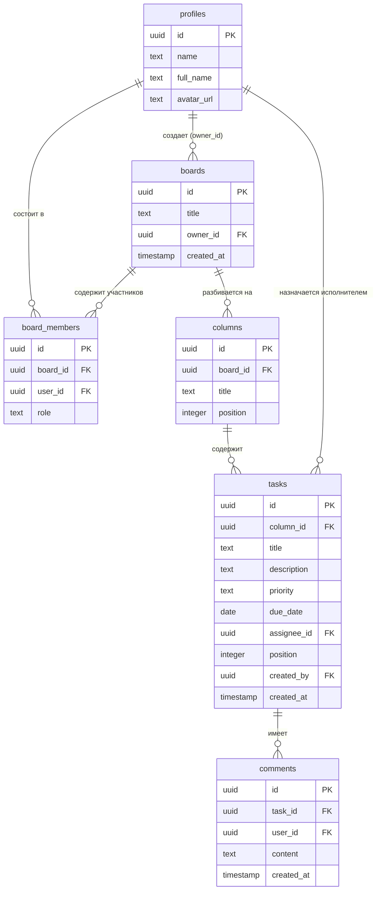
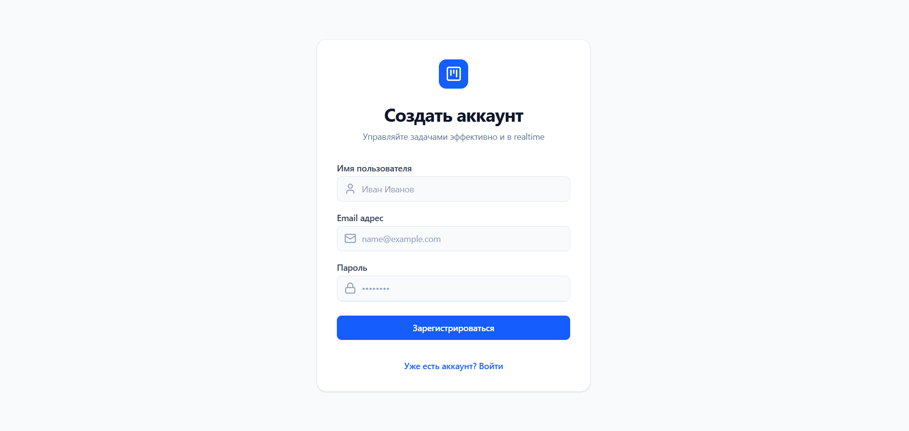
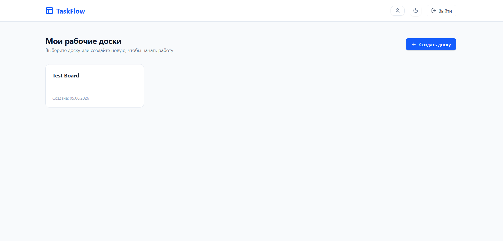
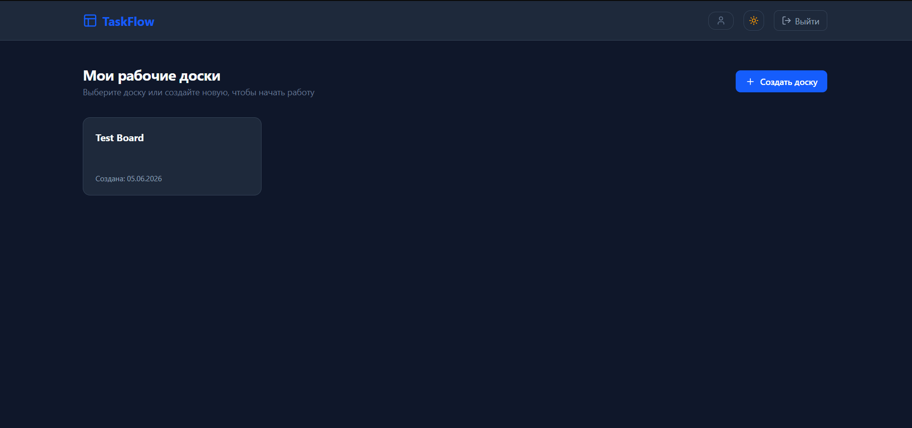
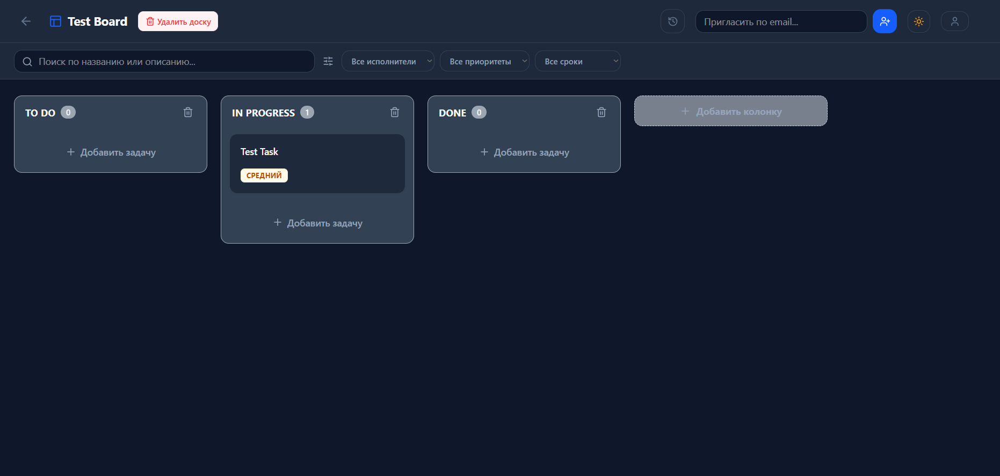
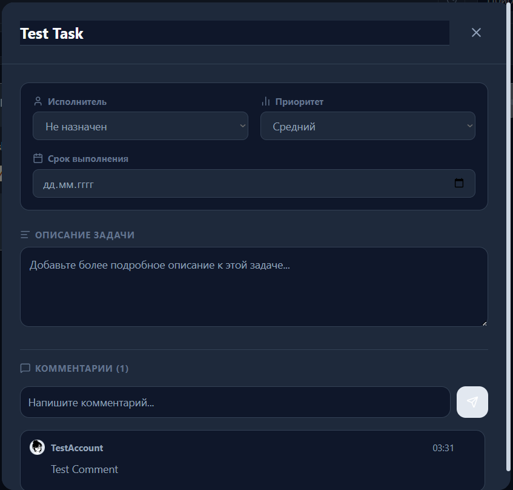
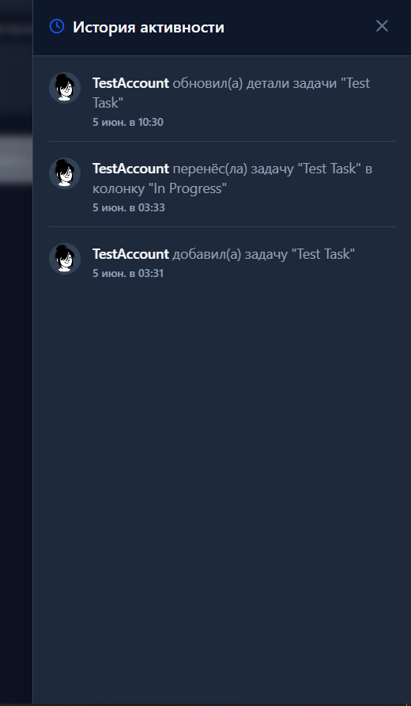

# TaskFlow — Реализация Канбан-Доски с Realtime-синхронизацией

Современное одностраничное приложение (SPA) для управления задачами и командной работы в реальном времени. Проект спроектирован с упором на производительность, строгую типизацию и мгновенный отклик интерфейса (Optimistic Updates / Realtime).

## Ссылки проекта

- **Продакшн деплой:** [Открыть работающее приложение на Vercel](https://flow-task-two-rho.vercel.app/)
- **Файл схемы БД:** в `/supabase/migrations/20260607000000_schema.sql`

---

## Технологический стек

- **Frontend:** React 18 (Vite), TypeScript (Strict Mode)
- **Стилизация & UI:** Tailwind CSS, Lucide React (иконки)
- **State Management & Data Fetching:** TanStack Query v5 (React Query)
- **Backend-as-a-Service (BaaS):** Supabase (PostgreSQL, Auth, Realtime Channels, RLS)
- **Drag and Drop:** `@dnd-kit/core`, `@dnd-kit/sortable`
- **Уведомления:** `sonner` / `react-hot-toast`

---

## Статус реализации (Уровни ТЗ)

### MVP (Базовый уровень)

- **Аутентификация:** Безопасная регистрация и вход (Email/Пароль) через Supabase Auth. Предусмотрен `ProtectedRoute` для защиты приватных роутов.
- **Управление досками:** Создание, переименование и удаление досок владельцем.
- **Структура доски:** При создании новой доски автоматически генерируются три стандартные колонки: _To Do_, _In Progress_, _Done_.
- **Управление задачами:** Добавление карточек, деструктурированное удаление и полноценное редактирование во всплывающих окнах.
- **Drag and Drop:** Полноценный перенос карточек между колонками и сортировка внутри одной колонки.

### Full (Продвинутый уровень)

- **Детализация задач:** Расширенная карточка (детальное описание через `textarea`, дедлайн, приоритеты `low`/`medium`/`high`).
- **Совместная работа:** Назначение исполнителей (assignee) из числа участников доски.
- **Управление доступом:** Реализована кастомная функция PostgreSQL + View для безопасного приглашения пользователей по Email. Доступ к доске строго разграничен политиками безопасности СУБД.
- **Регуляция прав:** Только создатель доски (Owner) имеет привилегию на её безвозвратное удаление.
- **Realtime комментарии:** Возможность обсуждения задач прямо внутри карточки, сообщения синхронизируются мгновенно у всех участников.

### Bonus (Дополнительный уровень)

- **Фильтрация и поиск:** Мгновенный поиск задач по названию, а также гибкие фильтры по приоритету, дедлайнам и исполнителю.
- **Лог активности (Activity Logs):** Интерактивная боковая панель с историей действий («Кто, что и когда сделал»), завязанная на реактивные обновления профилей.
- **Темизация:** Полноценный Dark Mode, подстраивающийся под системные настройки пользователя или переключаемый вручную с сохранением в `localStorage`.
- **UX / Горячие клавиши:** Быстрое создание задачи по кнопке `N`, мгновенное закрытие модальных окон по нажатию кнопки `Esc`.

---

## Архитектурные решения

В процессе проектирования архитектуры приложения были приняты следующие ключевые технические решения:

### 1. Почему TanStack Query (React Query v5)?

Вместо написания громоздких кастомных `useEffect` и ручного управления состояниями загрузки/ошибок, управление серверным состоянием полностью делегировано React Query.

- **Кэширование и синхронизация:** Данные автоматически считаются "устаревшими" (stale) через заданный промежуток времени и эффективно обновляются в фоне.
- **Инвалидация кэша:** После мутаций (например, добавления задачи) приложение точечно инвалидирует нужные ключи кэша (`['tasks', boardId]`), что гарантирует актуальность UI без полной перезагрузки страниц.
- **Декларативность:** Инструмент предоставляет из коробки удобные стейты `isLoading` и `isError`, избавляя код от спагетти-стейтов.

### 2. Почему @dnd-kit/core?

Для реализации Drag and Drop была выбрана библиотека `@dnd-kit` вместо устаревших или тяжеловесных аналогов (таких как `react-beautiful-dnd`).

- **Модульность и легковесность:** Мы импортируем только то, что используем (`DndContext`, `PointerSensor`), минимизируя финальный бандл.
- **Производительность:** Библиотека не вызывает лишних ререндеров всей страницы при перетаскивании, обеспечивая плавность даже на слабых устройствах.
- **Кастомизация сенсоров:** Позволяет гибко настраивать активацию drag-событий (например, задержка на перемещение, чтобы не ломать обычный скролл на мобильных устройствах).

### 3. Почему Supabase Realtime (PostgreSQL Changes)?

Синхронизация данных в реальном времени построена на возможностях встроенного брокера сообщений Supabase.

- **Меньше кода на бэкенде:** Нет необходимости писать, деплоить и поддерживать собственный Node.js WebSocket-сервер.
- **Прямая интеграция с БД:** Фронтенд подписывается непосредственно на события изменений в таблицах `columns`, `tasks` и `comments` для конкретного `board_id`. Любая транзакция в PostgreSQL мгновенно транслируется всем активным клиентам.

---

## 🗄️ Архитектура базы данных

Ниже представлена ER-диаграмма связей таблиц в PostgreSQL (Supabase), описывающая структуру проекта:



---

## Ограничения проекта и направления развития

Любой коммерческий продукт имеет компромиссы. В данной версии зафиксированы следующие ограничения:

1. **Масштабируемость сортировки Drag and Drop:** Сейчас позиция элемента определяется целочисленным индексом `position`. При переносе элемента высчитывается его порядковый номер. Для высоконагруженных систем промышленным стандартом является использование **дробных индексов (Fractional Indexing / Lexorank)**, что позволит менять элементы местами за один `UPDATE`-запрос без пересчета индексов соседних элементов.
2. **Отсутствие бинарного хранилища:** В текущей конфигурации к задачам нельзя прикреплять файлы. В будущем планируется подключить **Supabase Storage** для загрузки скриншотов и документов к карточкам задач.
3. **Глубина покрытия тестами:** На данном этапе фокус был смещен на скорость доставки фич и идеальную работу Realtime-слоя. Проект нуждается в интеграционном тестировании критических путей (Auth, Движение задач) с использованием `Vitest` и `MSW` (для мокинга сетевых запросов Supabase).

---

Как это работает

1. Регистрируемся/Логинимся



2. Создаём доску по нажатию на соответствующую кнопку



3. При желании можно сменить цветовое оформление



4. На доске будут созданы 3 стандартные колонки. Создаём задачу



5.  Детали задачи можно редактировать в модальном окне



6. Все изменения фиксируются в логах



---

## 💻 Инструкция по локальному запуску

### 1. Клонирование и установка

```bash
git clone [https://github.com/Aidimys/FlowTask](https://github.com/Aidimys/FlowTask)
cd taskflow
npm install
```

2. Настройка базы данных (Supabase)
   Создайте новый бесплатный проект на supabase.com.

Перейдите в раздел SQL Editor в панели управления Supabase.

Скопируйте содержимое файла схемы supabase/migrations/20260607000000_schema.sql из репозитория проекта, вставьте его в редактор и нажмите Run. Схема таблиц, функции защиты RLS, вью и процедуры будут развернуты автоматически.

3. Конфигурация окружения
   Создайте файл .env в корневом каталоге проекта:

```
cp .env.example .env
```

Заполните переменные данными вашего проекта (вкладка Project Settings -> API в Supabase):

```
VITE_SUPABASE_URL=your_supabase_project_url
VITE_SUPABASE_ANON_KEY=your_supabase_anon_public_key
```

4. Запуск приложения

```
npm run dev
```

Приложение откроется локально по адресу http://localhost:5173.
